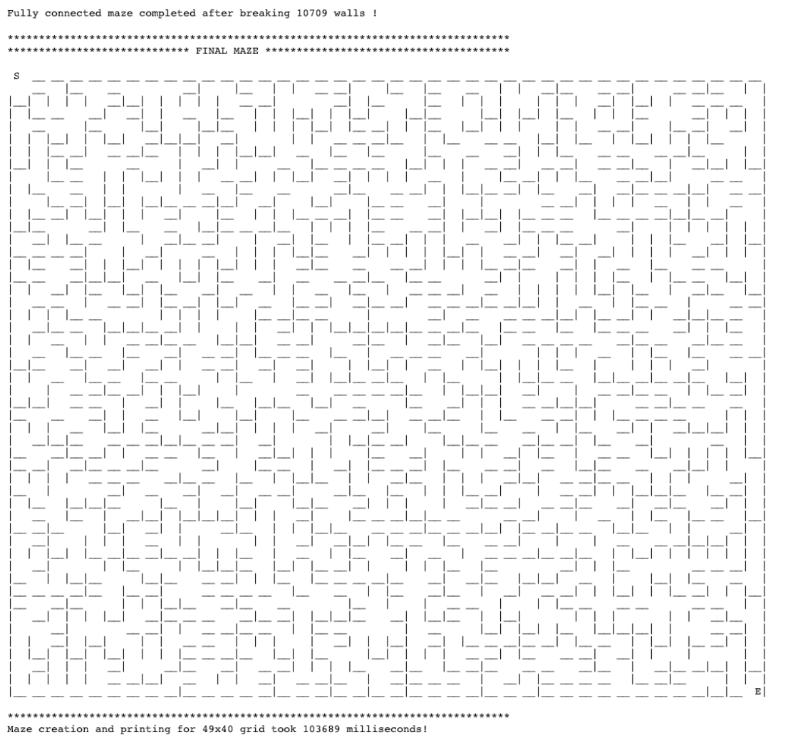

## Assignment 5
Implement a Maze Generator using UnionFind Algorithm with Path Compression

### WeightedQuickUnionFindWithPathCompression
This is a utility class that implements Weighted QuickUnion Find With Path Compression algorithm                                  
***************** Main operations *********************                                                                           
void union( elm1, elm2 )                 --> Merge two disjoint sets that elm1 and elm2 belong to                                 
int find( x )                            --> Return set name (i.e set's id) that contains element x                               
int count()                              --> returns # of disjoint sets currently                                                 
boolean isConnected(int x, int y)        --> Check if x & y are part of the same set or connected already                         
void createDisjSetsTreeMap()             --> Create a treemap where key is set's id (or its name) and values are elements in set  
String printDisjSets()                   --> print "Stringified" version of disjoint sets                                         
                                                                                                                                  
******************Error checks ********************************                                                                   
void validate(int p)     --> check if element is valid by checking its index

### Maze
The Maze class generates a random maze of a specific size taking as input number of rows and columns of cells in the maze                                                
uses Weighted Quick Union Find with Path compression (WQUFWPC) Algorithm on a set of cells with each cell representing a particular                                      
row and column location in the grid of cells.                                                                                                                            
                                                                                                                                                                         
Maze generation process:                                                                                                                                                 
1. User inputs grid size: M rows and N columns in maze. To make the printing of the grid work we limit the rows and cols each to >=2 and <=50                            
2. The maze is composed of objects from private inner class Cell which has 3 properties: a numeric cellIndex which represents its position (and also its name!) boolean variables horizontal and vertical which are true if the walls exist in that direction.                                                                           
3. We start by initializing MxN grid of cells which are all disconnected. This means each cell has all 4 walls except the starting cell (top left labeled 'S') and ending cell (bottom right labeled 'E'). We map these cells to the UnionFind Disjoint Set data structure and initialize each cell as its own singleton set with its parent pointing to itself (i.e) we will start with M*N disjoint sets where each set Si is a singleton with the i-th node only                                        
4. The maze is constructed by gradually breaking down the walls one at a time by choosing a cell randomly and an orientation randomly. (note: Since we need to connect top left to bottom right cell to form the maze, we prefer to break the walls that are either at the bottom or right and use the horizontal and vertical boolean flag to indicate which wall is broken. Since we have 2 horizontal and 2 vertical walls for each cell we may end up picking the same cell randomly and need to handle breaking the 2nd wall in the same horizontal or vertical orientation even if one is already broken)                    
5. As we break down each wall, we take the 2 cells between which a wall is broken and merge the 2 sets that they are part of into 1 set using union find algorithm with path compression. As we merge we take care to check the parent of each set being merged and make the smaller subset's parent point to the larger subset's parent (Weighted Union). At every step we print out which cell is chosen and which wall orientation is chosen to be broken and the disjoint sets as well as print out the maze at this step to show how we are progressing towards creating the fully connected maze                                                                           
6. As we break the cells, we handle for the boundary conditions of left and right columns and top and bottom rows and the starting and ending cells                      
7. We have a valid fully connected maze when all the cells are in the same set (i.e.) count of disjoint sets is 1 indicating we have a fully connected maze where each cell is connected to every other cell in the maze.
* Note: Maze will be assumed to always start from cell in top left corner and end at the cell in the bottom right corner  

### Example Maze 
Sample Image: 
                                                                                                                                                                         
                                                                                                                                  
